# Finance Analytics Dashboard

This project is a finance analytics portfolio dashboard built with Python, pandas, PostgreSQL, SQL, Power BI, and GitHub.

The goal of the project is to analyse synthetic company finance data and identify key business insights around revenue, expenses, profitability, budgets, clients, vendors, and payment risk.

## Project Objectives

The dashboard answers the following business questions:

- How much revenue is being invoiced each month?
- How much is being spent each month?
- Which months are profitable or loss-making?
- Which expense categories drive the highest costs?
- Which clients generate the most revenue?
- Which vendors receive the highest spend?
- Which departments are over or under budget?
- Which clients create payment and cashflow risk?
- How much revenue is paid, unpaid, or overdue?

## Tools Used

- Python
- pandas
- NumPy
- Faker
- Matplotlib
- PostgreSQL
- SQL
- Power BI
- Git
- GitHub

## Project Structure

```text
finance-analytics-dashboard/
│
├── data/
│   ├── raw/
│   └── cleaned/
│
├── powerbi/
│   └── finance_analytics_dashboard.pbix
│
├── reports/
│
├── scripts/
│   ├── generate_fake_finance_data.py
│   ├── clean_finance_data.py
│   ├── analyse_finance_data.py
│   └── create_finance_charts.py
│
├── sql/
│   ├── create_tables.sql
│   ├── 01_row_counts.sql
│   ├── 02_monthly_revenue.sql
│   ├── 03_monthly_expenses.sql
│   ├── 04_monthly_profit.sql
│   ├── 05_expense_category_summary.sql
│   ├── 06_client_revenue_summary.sql
│   ├── 07_vendor_spend_summary.sql
│   ├── 08_budget_vs_actual.sql
│   ├── 09_department_budget_summary.sql
│   ├── 10_client_payment_risk_summary.sql
│   ├── 11_invoice_status_summary.sql
│   ├── 12_monthly_cashflow_risk.sql
│   └── 13_monthly_finance_kpis.sql
│
├── README.md
└── .gitignore
```

## Dataset Overview

This project uses synthetic finance data generated with Python and Faker.

The raw datasets include:

- Departments
- Clients
- Vendors
- Invoices
- Expenses
- Budgets

The generated raw data includes:

| Dataset | Rows | Description |
|---|---:|---|
| departments.csv | 8 | Company departments |
| clients.csv | 50 | Client companies |
| vendors.csv | 40 | Vendor companies |
| invoices.csv | 600 | Client invoice records |
| expenses.csv | 900 | Company expense records |
| budgets.csv | 96 | Monthly department budgets |

## Python Analysis Outputs

The Python analysis creates the following reports:

| Report | Purpose |
|---|---|
| monthly_revenue.csv | Monthly invoiced revenue and invoice counts |
| monthly_expenses.csv | Monthly expense totals |
| monthly_profit.csv | Monthly revenue, expenses, profit, and margin |
| expense_category_summary.csv | Expense breakdown by category |
| client_revenue_summary.csv | Revenue by client |
| vendor_spend_summary.csv | Spend by vendor |
| budget_vs_actual.csv | Monthly department budget comparison |
| department_budget_summary.csv | Yearly department budget performance |
| client_payment_risk_summary.csv | Client payment risk analysis |
| invoice_status_summary.csv | Paid, unpaid, and overdue invoice totals |
| monthly_cashflow_risk.csv | Monthly paid, unpaid, and overdue amounts |
| monthly_finance_kpis.csv | Dashboard-ready monthly KPI table |
| executive_summary.txt | Plain-English business summary |

## SQL / PostgreSQL Analysis

The cleaned finance data was imported into a PostgreSQL database called `finance_analytics`.

The database contains the following tables:

| Table | Description |
|---|---|
| departments | Company departments |
| clients | Client companies |
| vendors | Vendor companies |
| invoices | Invoice and payment records |
| expenses | Company expense records |
| budgets | Monthly department budgets |

The SQL layer recreates the main business analysis using PostgreSQL queries.

| SQL File | Purpose |
|---|---|
| create_tables.sql | Creates the PostgreSQL database tables |
| 01_row_counts.sql | Confirms successful table imports |
| 02_monthly_revenue.sql | Monthly revenue and invoice status analysis |
| 03_monthly_expenses.sql | Monthly expense analysis |
| 04_monthly_profit.sql | Monthly profit and margin analysis |
| 05_expense_category_summary.sql | Expense category analysis |
| 06_client_revenue_summary.sql | Client revenue ranking |
| 07_vendor_spend_summary.sql | Vendor spend ranking |
| 08_budget_vs_actual.sql | Monthly department budget variance |
| 09_department_budget_summary.sql | Overall department budget performance |
| 10_client_payment_risk_summary.sql | Client payment risk analysis |
| 11_invoice_status_summary.sql | Paid, unpaid, and overdue invoice totals |
| 12_monthly_cashflow_risk.sql | Monthly paid, unpaid, and overdue cashflow risk |
| 13_monthly_finance_kpis.sql | Monthly dashboard KPI summary |

## Power BI Dashboard

The Power BI dashboard contains five pages:

1. Executive Overview
2. Revenue Analysis
3. Expense Analysis
4. Budget vs Actuals
5. Cashflow & Payment Risk

The dashboard was built using the cleaned analysis outputs from the `reports/` folder.

## Key Insights

The business was profitable overall, but cashflow risk was a major concern because a large amount of invoiced revenue remained unpaid or overdue.

March 2026 was the strongest profit month, with a profit of R1,846,911.00 and a profit margin of 40.5%. However, March 2026 also had the highest outstanding amount of R2,061,065.73 and a low collection rate of 54.8%.

Human Resources was the most over-budget department overall. It spent R2,868,959.31 against a budget of R1,516,905.06, creating a negative variance of R1,352,054.25.

Training was the largest expense category, followed by Travel, Utilities, and Software.

Doyle Ltd was the highest-value client by invoiced revenue, generating R1,547,427.78 across 17 invoices.

Gardner, Robinson and Lawrence was the highest payment-risk client, with an overdue invoice rate of 60.0% and a late payment rate of 100.0%.

## Python Chart Preview

### Monthly Profit

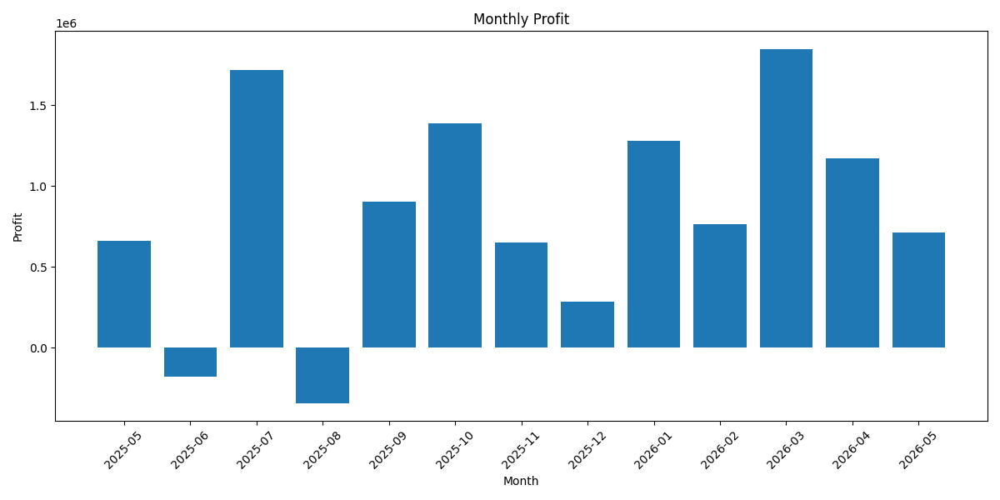

### Revenue vs Expenses

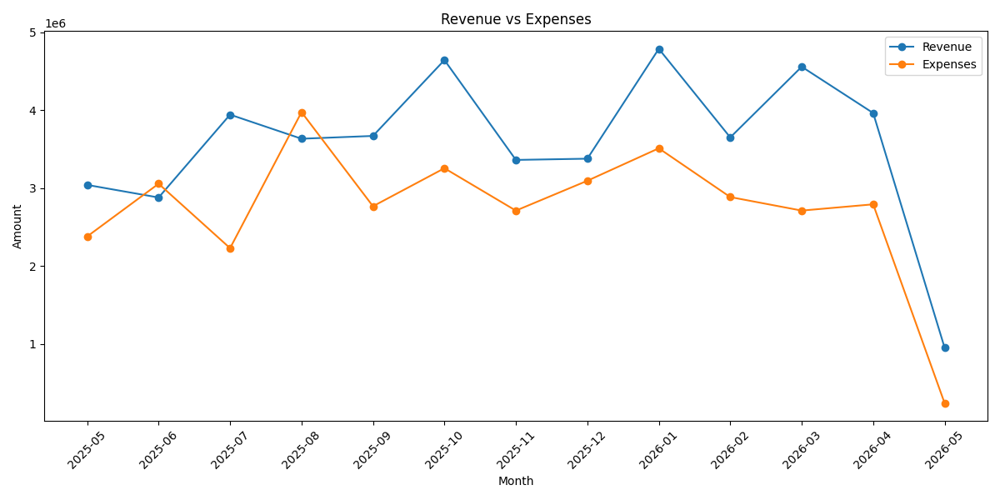

### Expenses by Category

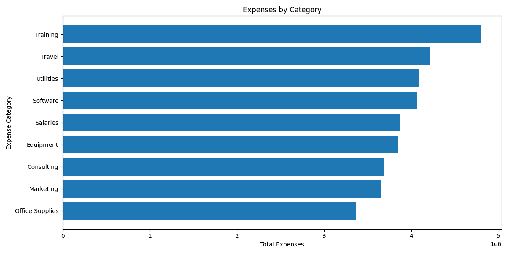

### Department Budget Variance

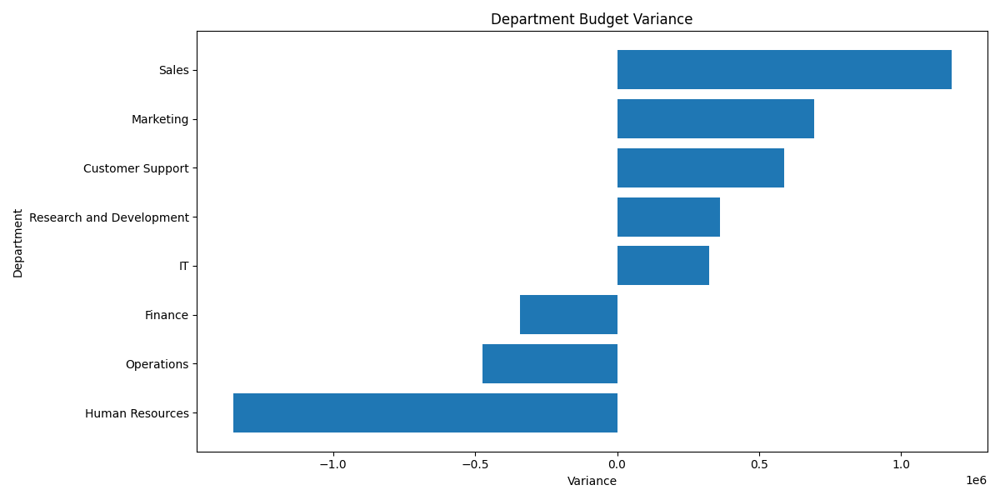

### Outstanding Amount by Month

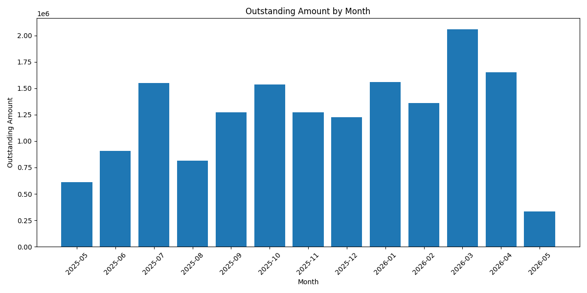

### Top Risky Clients

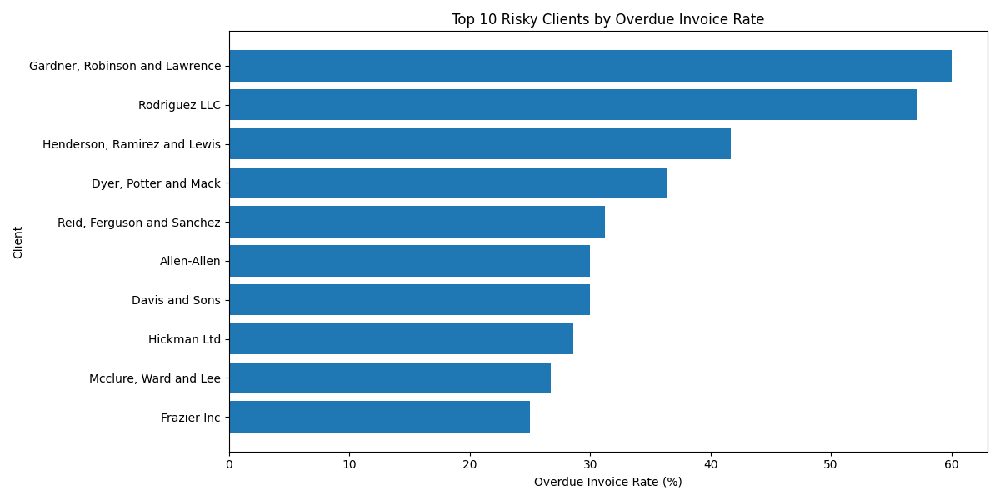

## Power BI Dashboard Preview

### Executive Overview

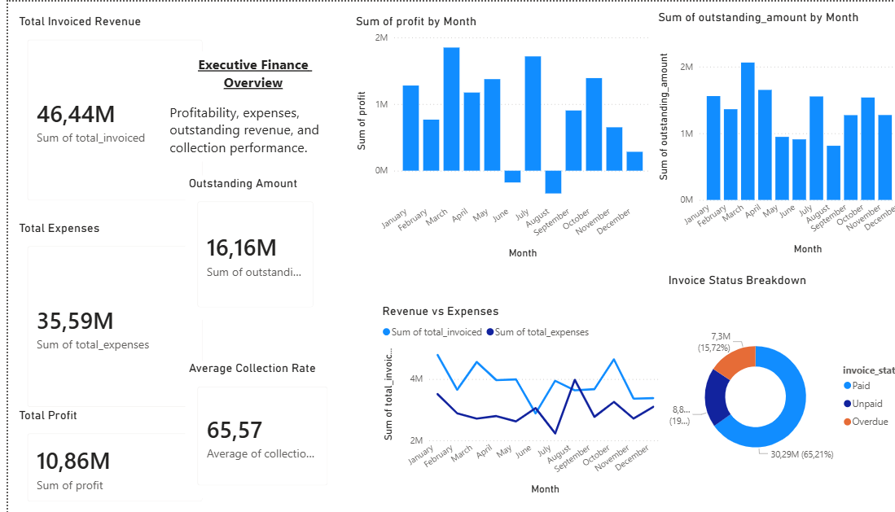

### Revenue Analysis

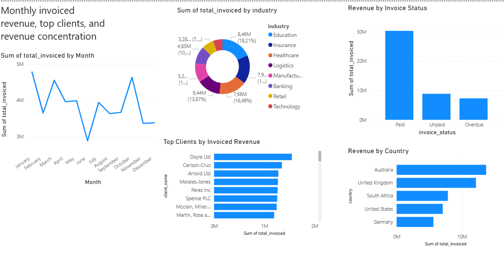

### Expense Analysis

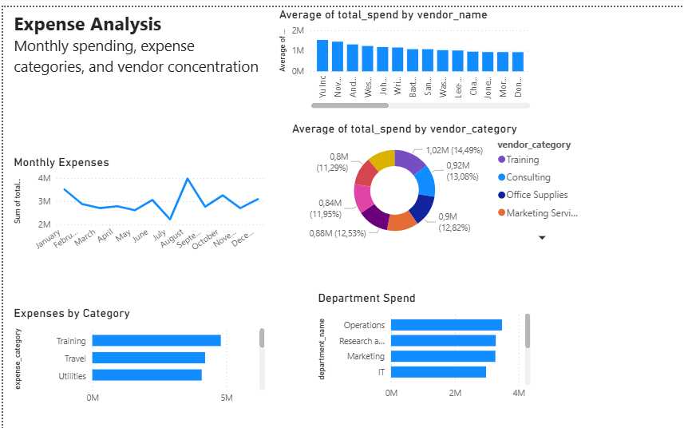

### Budget vs Actuals

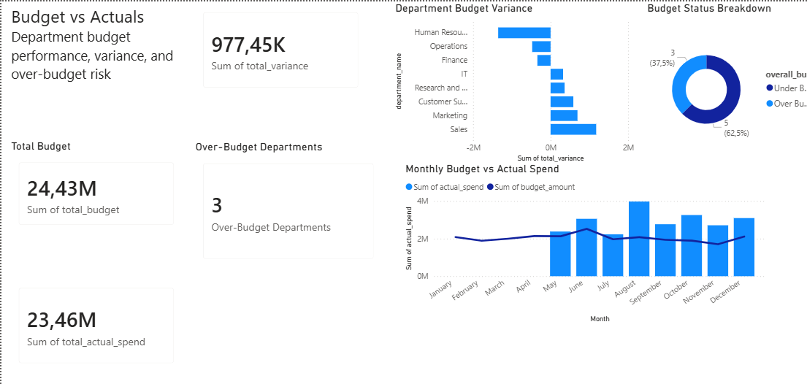

### Cashflow & Payment Risk

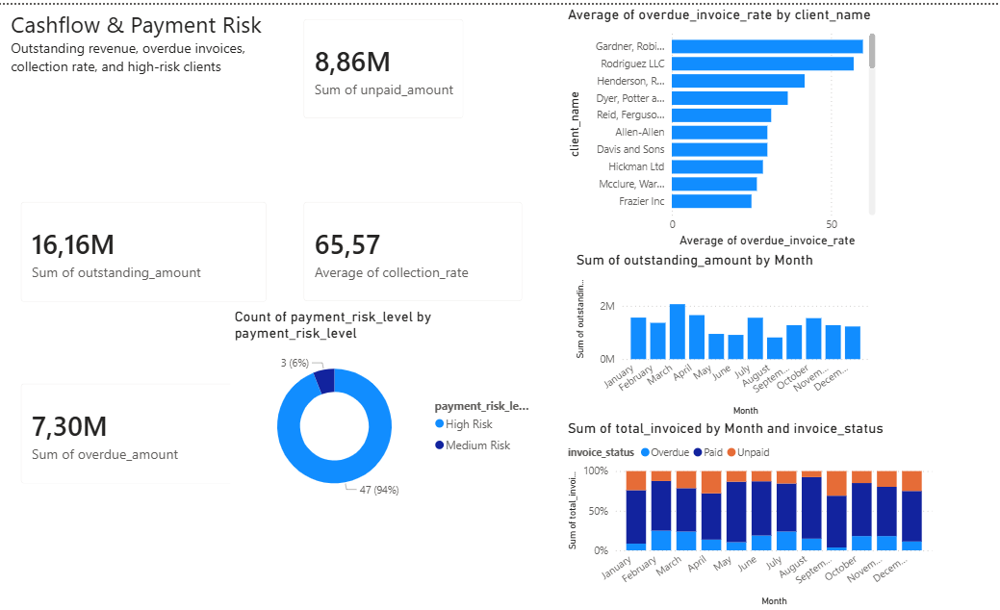

## Business Interpretation

This project shows that profit alone does not tell the full finance story. A business may appear profitable on paper while still facing cashflow pressure if a large portion of revenue remains unpaid or overdue.

The most important dashboard focus areas are:

- Profitability
- Expense control
- Budget variance
- Outstanding revenue
- Overdue invoices
- Client payment risk

## Skills Demonstrated

This project demonstrates the following Data Analyst / BI Analyst skills:

- Generating realistic synthetic business data
- Cleaning and enriching data with Python and pandas
- Creating reusable analysis scripts
- Building business-ready CSV outputs
- Writing SQL queries for finance analysis
- Using joins to combine relational tables
- Using CTEs for multi-step SQL analysis
- Creating calculated fields such as profit, profit margin, variance, outstanding amount, and collection rate
- Analysing budget vs actual performance
- Identifying payment and cashflow risk
- Building a multi-page Power BI dashboard
- Creating chart images and dashboard screenshots for portfolio presentation
- Using Git and GitHub for version control

## Project Status

This project currently includes:

- Synthetic finance data generation
- Data cleaning and enrichment
- Python/pandas analysis reports
- PostgreSQL database table structure
- SQL analysis queries
- Executive summary
- Chart image generation
- Power BI dashboard
- GitHub documentation